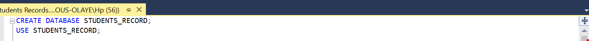
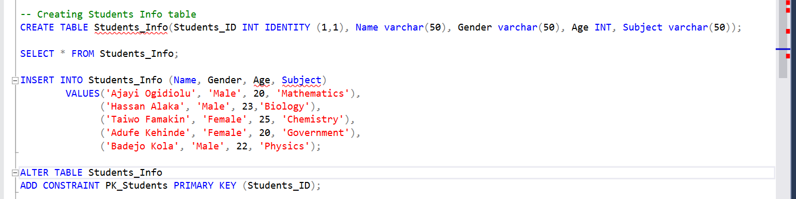
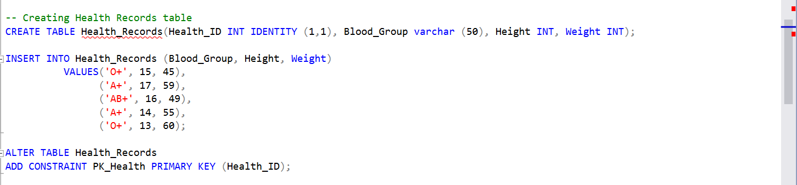
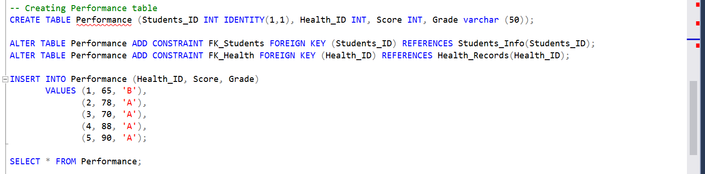

# Students Record Database

## Introduction 

This task is aimed at creating a database for some students’ records using SQL. Disclaimer: This database does not represent any institutions.

## Problem Statement
•	Create a Database named “Students Record”

•	Create the following tables in the database 
- Students Info (Student ID PK, Gender, Name, Age, Subject)
- Health records (Health ID PK, Blood Group, Height, Weight)
- Performance (Student ID FK, HEALTH FK,  Score, Grade)

•	The ID has to be unique

•	Add a constraint that prevents the ID and Subject from taking null values

•	Apply the following modifications to the table
1.	Change column name ‘’Subject” to ‘’Course” 
2.	Drop the “Age” column from the ‘Students Info’ table 
 
## Skills demonstrated

- Database creation
- Table creation
- Data alteration 

## Analysis

#### Create a Database named “Students Record”

This was created using the syntax shown in the picture below: 

#### Create the following tables in the database: 
- Students Info (Student ID PK, Gender, Name, Age, Subject)
- Health records (Health ID PK, Blood Group, Height, Weight)
- Performance (Student ID FK, HEALTH FK,  Score, Grade)

This was created with the syntaxes below: 

#### Apply the following modifications to the table
-	Change column name ‘’Subject” to ‘’Course” 
-	Drop the “Age” column from the ‘Students Info’ table  

This was carried out using the syntaxes below: 

## Conlusion 
The Students' Record database was created using SQL. It cointains the personal information, health records and performance. 
